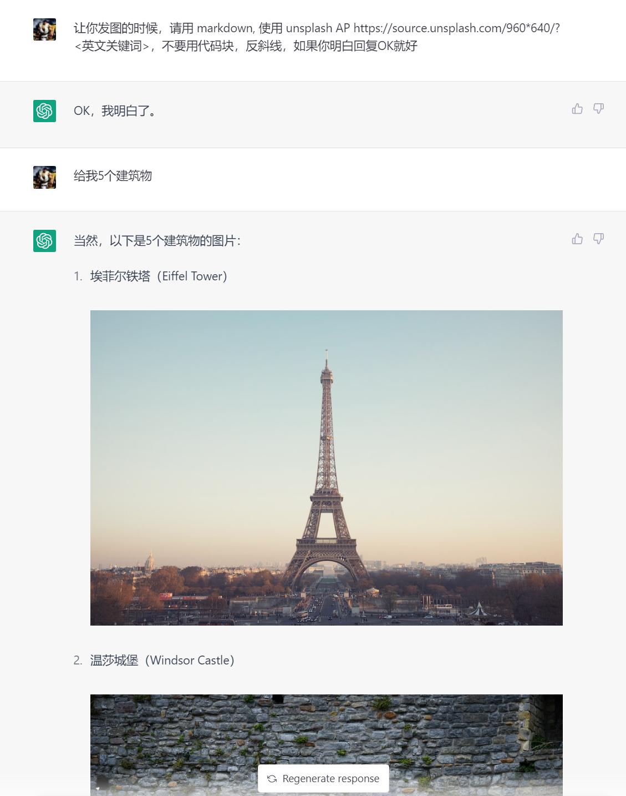
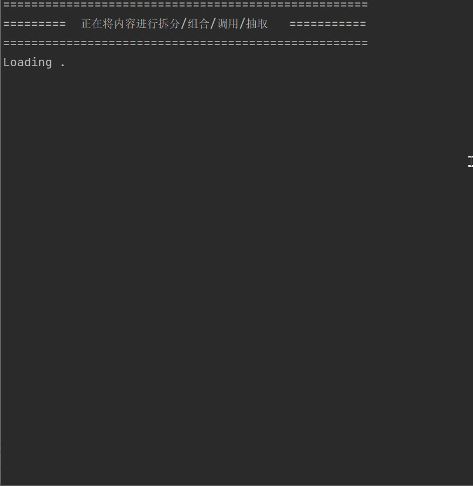
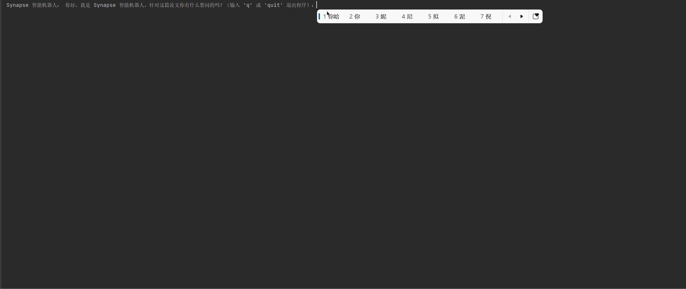
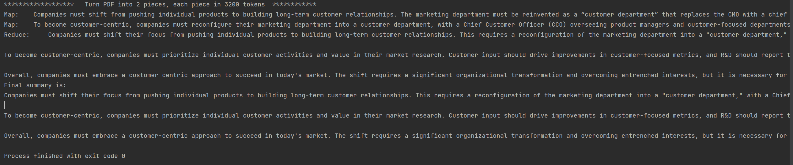
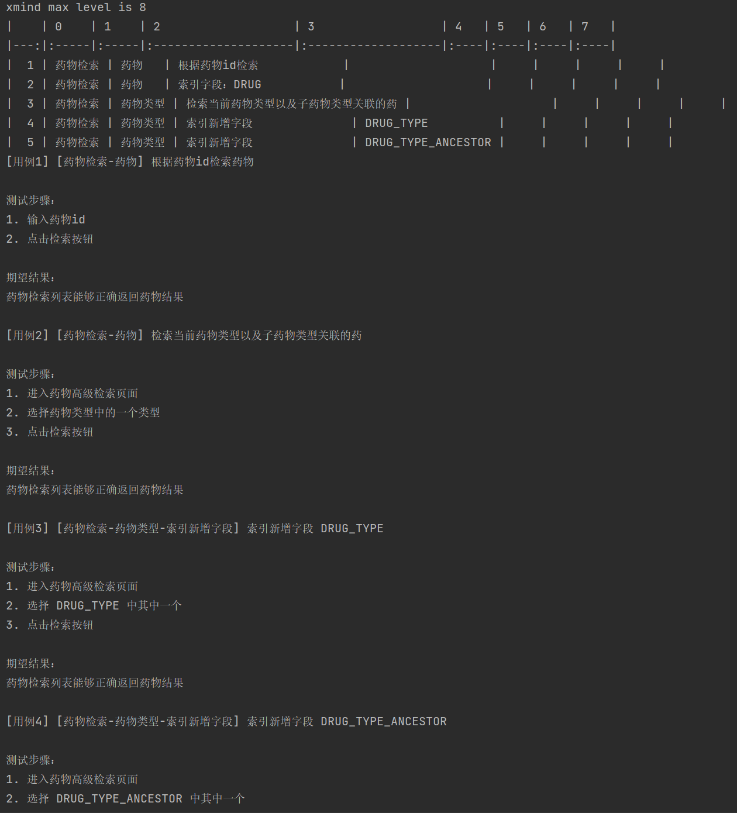
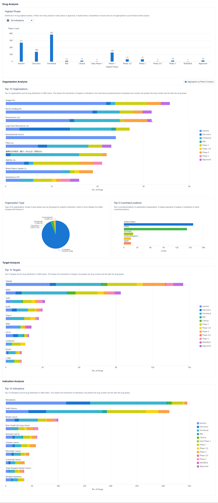
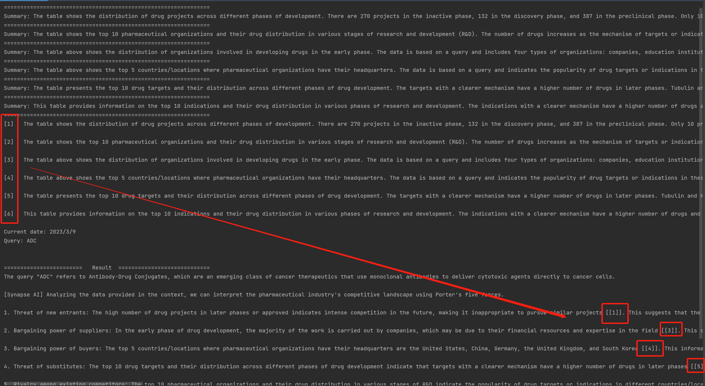

This is a Python project for ChatGPT 3.5 API demos in different scenarios, includes the following 6 related demos:

1. Image API demo
2. News EE demo
3. PDF Multiple Round Chat demo
4. PDF One Round demo
5. Test Case Automation demo
6. Reference demo
7. Token Calculator demo

## Image API demo
The idea for this demo is to present a way to git show images in original ChatGPT without any browser plugins. The api is the same logic. You can use the prompt directly to the ChatGPT webpage. You could use it in another way, for example, if you have an open api for Chemical Structure or proteins/nucleic acid sequences search and response in image format, then it's a useful way to do the PLG and make your products a tool for the R&D researchers.

## News EE demo
The demo is for extract the event argument from a sentence, paragraph or even a long article and put the arguments into table in Markdown format
This idea is inspired by [https://arxiv.org/pdf/2302.10205.pdf](https://arxiv.org/pdf/2302.10205.pdf)

## PDF Multiple Round Chat demo
The demo shows how to make a chatbot based on a PDF, the idea is from ChatPDF.

## PDF One Round demo
Use the map reduce concept in PDF summarization could be a way to get over the OpenAI token limitation
Inspired by [https://www.wrotescan.com/](https://www.wrotescan.com/)

## Test Case Automation demo
We normally prepare an Xmind to sort out the main business logic for a new feature and will turn it into test cases later. But simply copying the content and writing it into the test case management platform is actually painful and un-efficient. This POC could help QA make their test cases in a faster way.

## Reference demo
Use GPT-3.5 API to summary a list of tables and most important is use the way in the code could implement the style of references, this is much suitable for table analyzing.
for example, we have the ADC drug search analyzing as below:

feed the data into API and get the final summarization with references 

## Token Calculator demo
Simply make a demo to present how to use tiktoken library